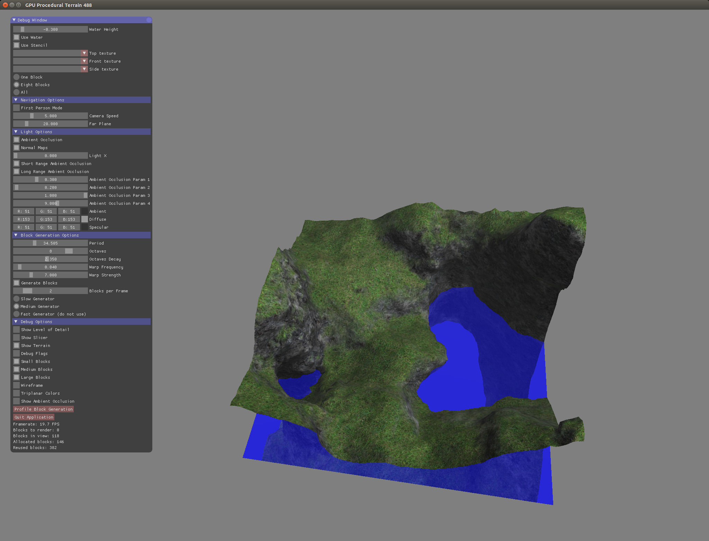
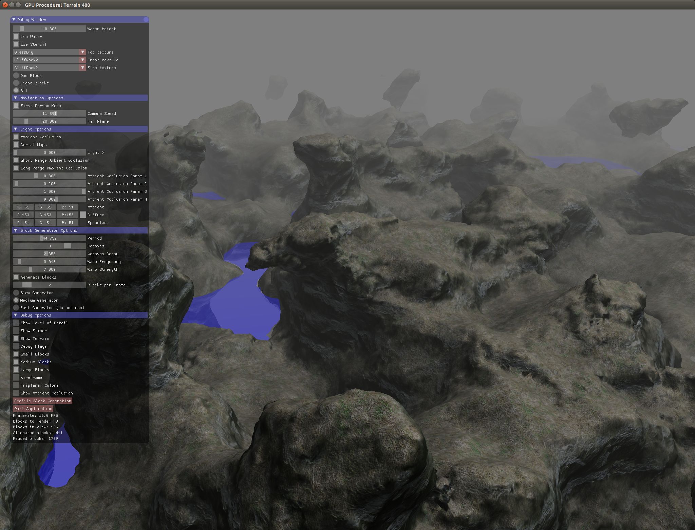

# Generating Volumetric Terrain Procedurally Using the GPU






Based on Ryan's Geiss chapter in GPU Gems 3: http://http.developer.nvidia.com/GPUGems3/gpugems3_ch01.html

Use to scroll around. If you toggle first-person mode, use the WASD keys to move forward/backwards left/right and Q/E to move up/down.

## Build

```
$ cd procedural-terrain-488
procedural-terrain-488$ premake4 gmake
procedural-terrain-488$ make
procedural-terrain-488$ cd src
procedural-terrain-488/src$ premake4 gmake
procedural-terrain-488/src$ make
```

Tested to work on gl30.student.cs.uwaterloo.ca and any machine that has a GTX 980.

## Objectives

1. UI: Create a first-person camera and appropriate controls to navigate the scene, including moving in all 3 axes, adjusting the movement speed and rotating the camera.
2. Modelling: Add geometry to represent water to the scene.
3. Implement 3D Perlin Noise to generate a terrain density function.
4. Implement the Marching Cubes algorithm to generate triangles out of the density function.
5. Implement ambient occlusion by casting out shadow rays for each vertex.
6. Map textures onto the generated mesh by using triplanar texturing.
7. Implement bump mapping by mapping a bump map texture onto the generated mesh to perturb normal vectors.
8. Optimize terrain generation code by splitting terrain generation work into smaller units with multiple shader passes to eliminate redundant work (e.g. shared vertices) as described in the book chapter.
9. Implement level-of detail rendering and alpha blending to improve the transition between blocks of terrain of different resolutions from level-of-detail rendering, which will require rendering the blocks furthest away first.
10. Implement reflection for water by rendering the water twice, once as a stencil, and reflected scene within the stencil, then the water on top of the reflection with transparency.

---

## Dependencies
* OpenGL 3.2+
* GLFW
    * http://www.glfw.org/
* Lua
    * http://www.lua.org/
* Premake4
    * https://github.com/premake/premake-4.x/wiki
    * http://premake.github.io/download.html
* GLM
    * http://glm.g-truc.net/0.9.7/index.html
* AntTweakBar
    * http://anttweakbar.sourceforge.net/doc/


---
